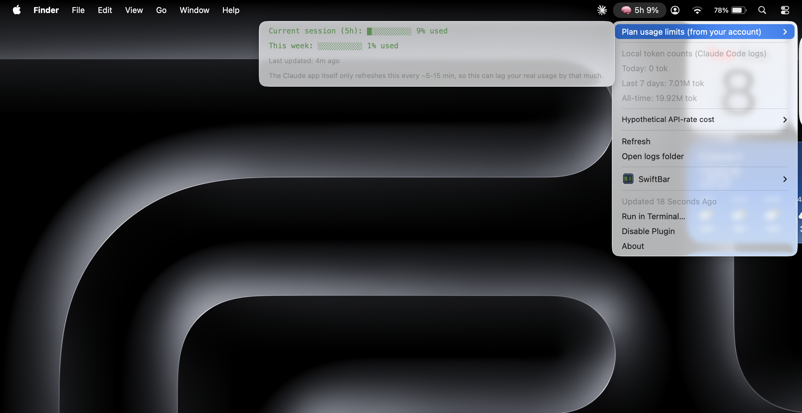

# Claude Usage Bar

A tiny [SwiftBar](https://github.com/swiftbar/SwiftBar) / [xbar](https://xbarapp.com/) plugin that puts your **Claude Code** token usage and your **Claude account's plan-limit percentage** right in your macOS menu bar.

Everything runs locally. No network calls, no API keys, no accounts — it just reads files already on your disk.


<!-- Replace the image above with a real screenshot of your menu bar dropdown. -->

## What it shows

- **Current 5-hour session usage %** and **weekly usage %** — the same numbers as the "Current session" bar in the Claude desktop app's Settings → Usage page
- **Local token counts** from Claude Code (today / last 7 days / all-time)
- A rough **hypothetical API-rate cost** for a sense of scale (see [Important caveats](#important-caveats) — this is *not* your real bill)
- A breakdown by model and by project for today's usage

## Requirements

- macOS
- [Node.js](https://nodejs.org) — `brew install node`
- [SwiftBar](https://github.com/swiftbar/SwiftBar) — `brew install --cask swiftbar`
- [Claude Code](https://claude.com/claude-code) used at least once, so `~/.claude/projects/**/*.jsonl` exists
- Optional: the **Claude desktop app**, installed and opened at least once — this is what maintains `~/Library/Application Support/Claude/plan-usage-history.json`, which powers the plan-limit bars. Without it, the plugin still works and just shows local token counts instead.

## Install

```bash
git clone https://github.com/prasathdev15/claude-usage-bar.git
cd claude-usage-bar
./install.sh
```

This copies the plugin into `~/.swiftbar-plugins`, points SwiftBar at that folder, and launches SwiftBar. Look for the 🧠 icon in your menu bar (may take up to 30 seconds to appear on first launch).

To install to a different SwiftBar plugin folder: `./install.sh /path/to/your/plugins`

To uninstall: quit SwiftBar and delete `claude-usage.30s.js` from your plugin folder.

## How it works

Claude Code writes a JSONL log of every API call — tokens used, model, timestamp, working directory — to `~/.claude/projects/`. This plugin scans those logs every 30 seconds (the `30s` in the filename is SwiftBar's refresh-interval convention — rename the file to change it, e.g. `claude-usage.1m.js`) and aggregates token counts by day, model, and project.

Separately, the Claude desktop app keeps a small local cache of your account's live 5-hour/weekly plan-limit percentage, used to render its own usage bar. This plugin reads that same file to show the real percentage — not a guess.

## Important caveats

- **The plan-limit cache file is undocumented.** `plan-usage-history.json` is a private, reverse-engineered file the Claude desktop app uses for its own UI — it is not a published API and Anthropic could change its format or location in any future update. If that happens, the plan-limit section will silently disappear (local token counts are unaffected, since those come from Claude Code's own stable log format).
- **The plan-limit numbers lag by up to ~5-15 minutes.** The Claude desktop app itself only writes a fresh sample to that cache file every 5-15 minutes (measured from its own history), not in real time. The plugin re-reads the file every 30 seconds, so it shows the latest value about as fast as it's technically possible to — but that value can still be several minutes behind your actual usage. The dropdown shows a "Last updated" timestamp so this is never silently stale.
- **The dollar figures are not your real bill.** On a Pro/Max subscription, usage within your plan limits is flat-fee — no real money moves. The "hypothetical API-rate cost" shown here is just `local token count × public API list price`, useful only as a relative sense of scale, not your actual usage-credit spend.
- This only sees Claude Code usage **on this machine**. It can't see usage from other devices, or from claude.ai chat directly.

## License

MIT — see [LICENSE](LICENSE).
